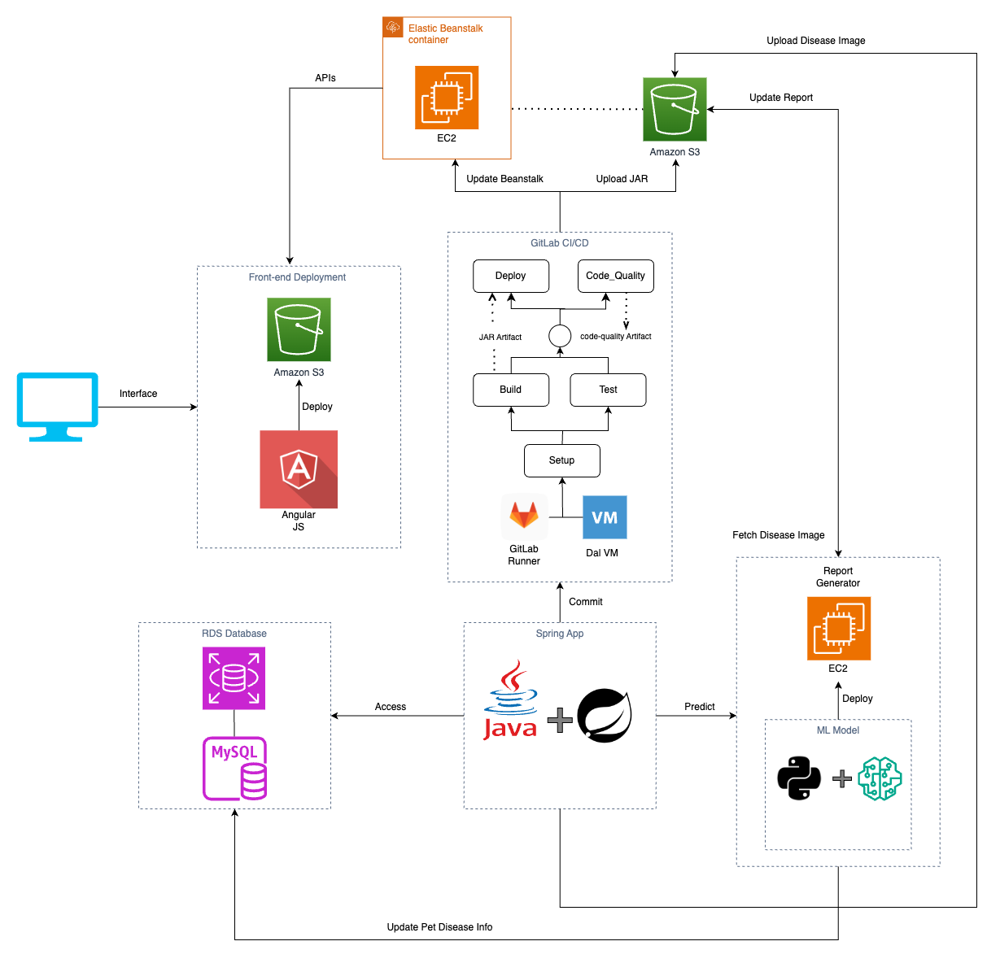
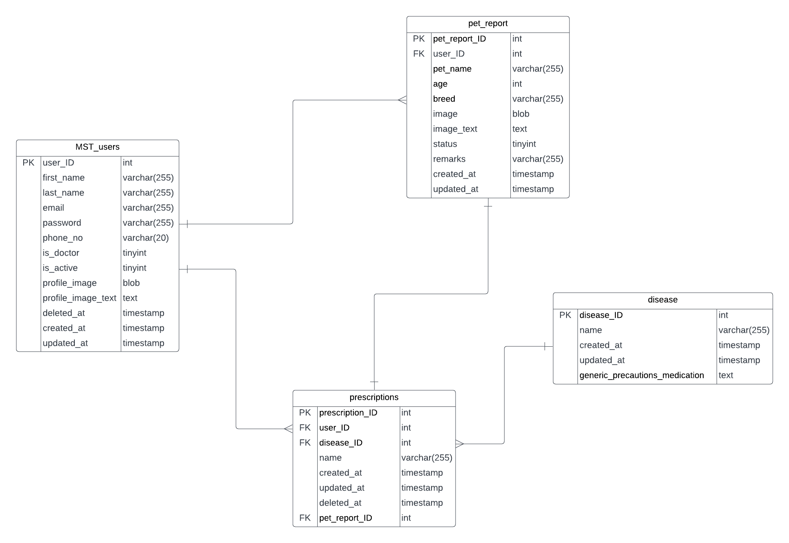
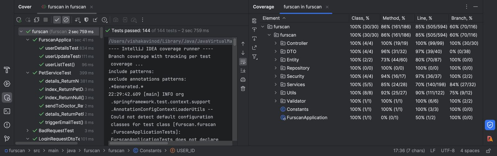

# FurScan

Empowering pet owners with advanced health insights. Our mission is to provide compassionate care for your beloved animals. Discover peace of mind through early disease detection and tailored wellness plans. Join us in nurturing a healthier, happier life for your furry companions.

## Overview

Discover the powerful capabilities that FurScan brings to the world of canine dermatology. Our carefully curated set of features is designed to streamline the process of identifying and addressing skin issues in your furry companions. From cutting-edge AI analysis to expert vet verification, FurScan is your trusted partner in ensuring the well-being of your beloved dogs.

## Features

- **AI-Powered Diagnosis:** Leverage advanced artificial intelligence to swiftly identify a wide range of skin conditions, providing you with initial insights within minutes.

- **Vet Verification:** Rest easy knowing that our team of experienced veterinarians meticulously reviews every diagnosis, ensuring accuracy and reliability.

- **Detailed Reports:** Receive comprehensive reports that not only outline the identified issue but also offer potential causes and recommended next steps for your dog's skin health.

- **Secure User Accounts:** Create personalized accounts to keep track of your furry companions' cases, ensuring a seamless and tailored experience.

- **Multi-Pet Support:** Extend the platform to cater to owners who have multiple dogs, allowing them to manage and track the health of each pet.

- **Case History Management:** Allow users to easily access and manage the history of their dog's skin condition cases, including previous diagnoses, treatments, and progress.

## App Development Flow

## ER Diagram

## Technologies Used

- Java Spring Boot
- Angular
- NodeJS 
- AWS Beanstalk to deploy backend
- Amazon S3 to deploy frontend

Click [here](https://youtu.be/0vPAMmmPHr0) to watch the project demo.

### Detailed Scenarios

#### 1. Homepage
The homepage prominently showcases our product's purpose. Users can click on "LEARN MORE" to explore detailed information about the app, including sections such as About Us, Contact, FAQs, and Features. The "SIGN IN" button allows users to log in or sign up for the app.
 
#### 2. Login Page
Upon clicking the "SIGN IN" button, users are directed to the authentication page. Here, existing users can log in, while new users can register. The page also features a "Forgot Password" option, allowing users to reset their password via an OTP sent to their email.
 
### 3. Register Page
During registration, users provide their details and upload a profile image (limited to 50kB, .jpg format only). After submission, users are directed to a Thank You page, where they can click the "LOGIN" button to access the app.
 
#### 4. User Dashboard
Upon logging in, users are greeted with a welcome message and access to an upload button, account settings, and logout option. The dashboard displays a message if no images are uploaded and a table with record details if images are present. The table includes fields for record ID, dog name, breed, status, and details. Users can search by pet name and navigate through paginated records.
 
#### 5. Upload Pet Details
Clicking the "UPLOAD" button on the dashboard directs users to a page where they can input pet details and upload a disease image (limited to .jpg format and 600kB). After submission, an AI-generated report is downloaded, and users return to the dashboard to view the new pet details.
 
#### 6. Pet Details Page
Clicking the "eye" icon for a specific pet navigates users to a dedicated page where they can download the report and view identified diseases. Enabling the "send to doc" toggle triggers a snackbar notification confirming the report's dispatch to the doctor.
 
#### 7. Account Button
Users can access and edit their details by clicking the "ACCOUNT" button.
 
#### 8. Logout Button
Clicking the "LOGOUT" button terminates the user's session.
 
#### 9. Doctor Authentication
Doctor registration involves selecting "doctor" from the "type of user" dropdown. The remaining registration process is similar to that of a regular user.
 
#### 10. Doctor Dashboard
Doctors view reports sent by users on their dashboard. The table displays record details, dog name, breed, age, report, status, and an "add note" option. Doctors can add remarks, and the updated report is sent to both the user and the doctor. The dashboard also allows doctors to search and modify clinic details. The "ACCOUNT" and "LOGIN" buttons function similarly to those for users.

## Tests 
- All possible scenario are covered by tests including border conditions
- Integration tests are written
- A total of 137 tests were written
- The tests are written following the best practices
- TDDs were used for most of the commits
- Following Coverage numbers were achieved
  - Class - 100%
  - Line - 85%
  - Method - 86%
  - Branch - 60%

## Code Quality 

#### Design Principles Adherence:

1. **SOLID Principles:**
   - Single Responsibility Principle (SRP): Each class has a single responsibility.
   - Open/Closed Principle (OCP): Code is open for extension but closed for modification.
   - Liskov Substitution Principle (LSP): Subtypes can substitute their base types seamlessly.
   - Interface Segregation Principle (ISP): Interfaces are tailored to client needs.
   - Dependency Inversion Principle (DIP): High-level modules depend on abstractions, not details.

2. **Cohesion and Coupling:**
   - High Cohesion: Related functionality is grouped together within classes.
   - Loose Coupling: Dependencies are minimized between classes and modules.

3. **Clean Code Practices:**
   - Small Methods: Methods are concise, focusing on specific tasks.
   - Meaningful Comments: Comments explain the rationale and why decisions were made.
   - Clear Conditionals: Avoids double negatives in conditions for readability.

#### Smell Detection and Refactoring:

- **Tool Used:** [Designite](https://www.designite-tools.com/)

- **Smell Categories:**
   1. **Architecture Smells:** Nearly non-existent.
   2. **Design Smells:** Almost non-existent.
   3. **Implementation Smells:** Rare instances, mostly refactored.
   4. **Test Smells:** Addressed where applicable.

#### Code Smells Report:

- **File:** [Code_Smells.xlsx](./imgs/Code_Smells.xlsx)
  - **Sheets:**
    1. **Architecture Smells:** Minimal occurrences, addressed during refactoring.
    2. **Design Smells:** Negligible instances, refactored where possible.
    3. **Implementation Smells:** Sparse occurrences, mostly resolved.
    4. **Test Smells:** Minimal occurrences, resolved as needed.

#### Refactoring Approach:

- **True Positives:**
   - Detected smells that were indeed issues were systematically refactored.

- **False Positives:**
   - Smells that were inaccurately detected were justified in the corresponding column.
   - Reasons include framework constraints, false tool interpretation, etc.

#### Conclusion:

The code adheres to SOLID principles, maintains high cohesion and loose coupling, and follows clean code practices. Smell detection and refactoring, facilitated by Designite, resulted in a codebase with minimal architectural, design, and implementation smells. Any false positives or unrefactorable instances are thoroughly documented in the [Code_Smells.xlsx](./imgs/Code_Smells.xlsx) file under 'Status' and 'Reason', ensuring a clear understanding of the decision-making process during code maintenance.

## Contributors
- Vishaka Vinod
- Mohammed Noor ul Hasan Kothaliya
- Rahul Puri Goswami
- Suyash Jhawer
- Samit Mhatre

